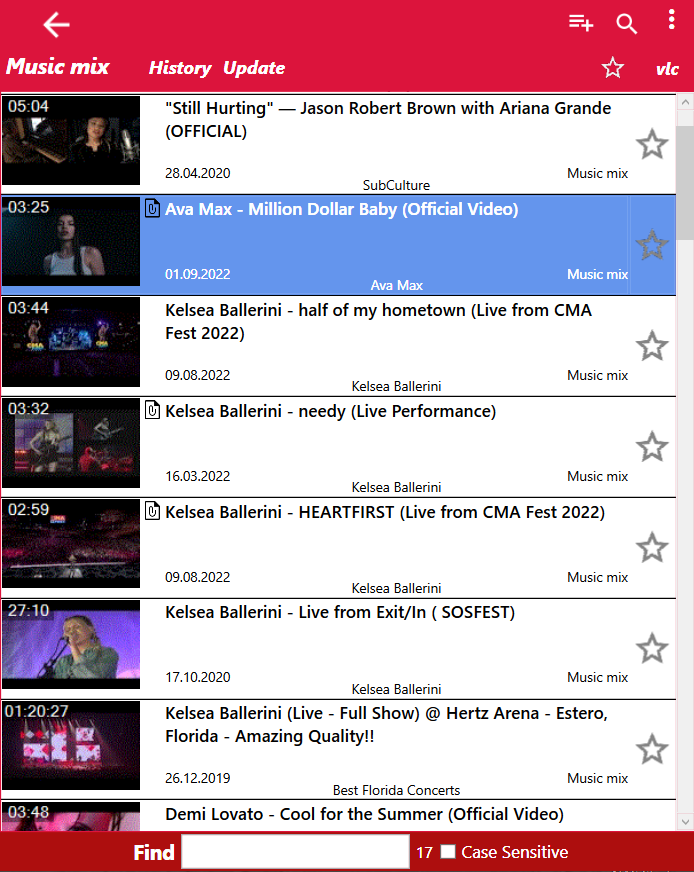

# VideoLinks
Organize all your Videos and more.

  
 
 ## Quick Start
 ### Add local file
 Drag & Drop folder or files to a list (+CTRL with subfolders)
 
 ### Add internet links
 Select link and press hotkey (Ctrl+Shift+Y) or copy link to clipboard  
 Copy link to clipboard and Ctrl+V to add to list
 
 ### Add Youtube Channel
 Copy Channel Link to Clipboard (usually it is the "Watch all" button on Youtube page) and press hotkey
 
 
 
