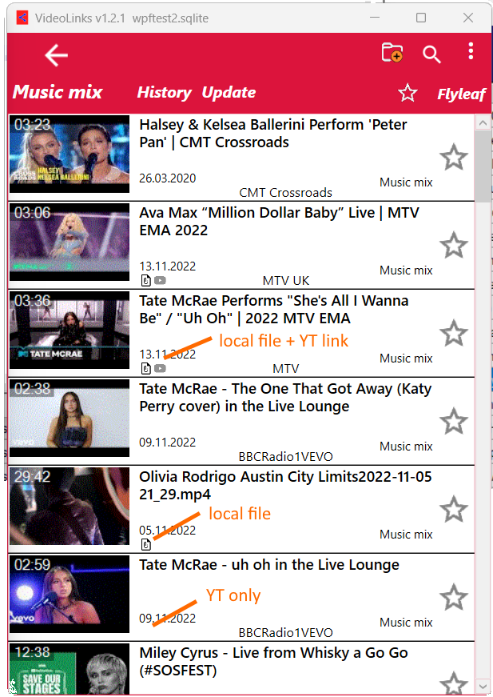

# VideoLinks
Organize all your Video links and more. Successor of VideoLinkSafe. 

## Further development at [Codeberg](https://codeberg.org/Isayso)

  
 
 ## Quick Start
  demo.sqlite file included, chose "open" on first start
 
 ### Add local file
 Drag & Drop folder or files to a list (+CTRL with subfolders)
 
 ### Add internet links
 Select link and press hotkey (Ctrl+Shift+Y) or copy link to clipboard  
 Copy link to clipboard and Ctrl+V to add to list. Works with Youtube, Rumble, Bitchute, Odysee.
 
 ### Add Youtube Channel
 Copy Channel Link to Clipboard (usually it is the "Watch all" button on Youtube page) and press hotkey
 
 ### Import SQLite files from VideoLinkSafe or NewPipe
 Go to Import menu and choose the old sqlite file
 
 ## Keyboard shortcuts
 Ctrl+    
 -F: find in list    
 -S: find in SQL  
 -C: copy video link  
 -V: import video link and Youtube list  
 -A: select all videos  
 -D: download YT video  
 -D&D: import local files with subfolder  
 
 
